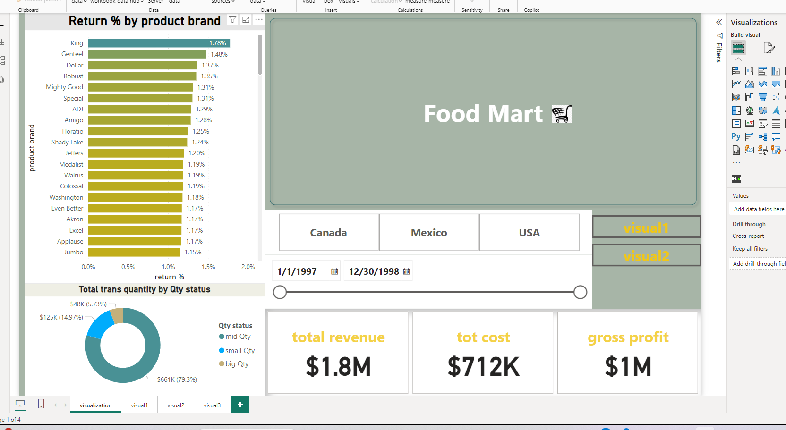
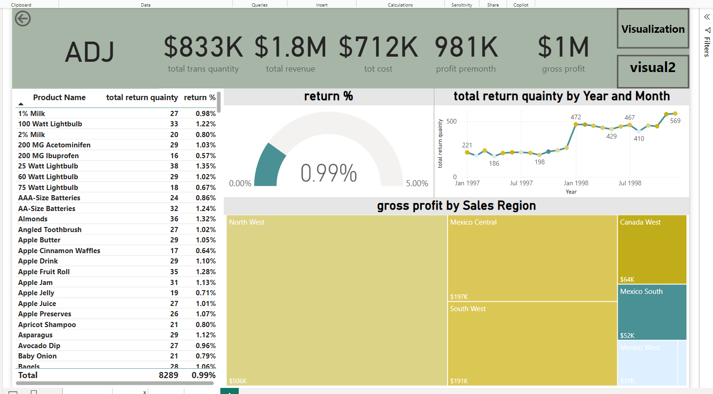
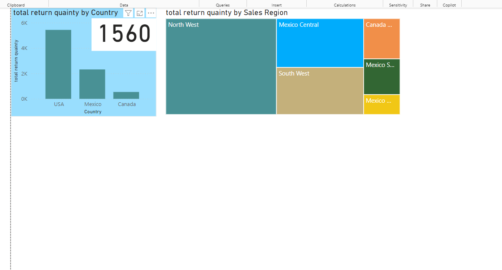

# 📊 Food Mart Data Analysis

Welcome to the **Food Mart Data Analysis** project! This project involved an in-depth exploration of sales data for a food mart, spanning the years **1997 to 1998**. Below are the key highlights of the analysis:

## 🚀 Key Features of the Analysis

- **📈 Return Percentages by Product Brand**:  
  Calculated return percentages to understand brand performance.

- **💰 Revenue, Cost, and Gross Profit Analysis**:  
  Examined total revenue, total cost, and gross profit to gauge overall business health.

- **🌳 Tree Map Visualization**:  
  Created a tree chart to showcase the relationship between **gross profit** and **sales regions**.

- **🎓 Gross Profit by Education Level**:  
  Analyzed how customer education levels impacted gross profit.

## 🧐 Insights Gained

This analysis provided valuable perspectives on:  
- 📦 **Product Performance**  
- 🏙️ **Regional Sales Trends**  
- 👥 **Customer Demographics**

## 📁 Files and Resources

- Data: `food_mart_1997_1998.csv`
- Visualizations:  
  - Tree Map (`tree_map.png`)  
  - Gross Profit by Education Level (`education_gross_profit.png`)

## 📊 Visualization Example

Here's a sneak peek at one of the visualizations from the analysis:

---

Feel free to explore the data and reach out with any questions! 😊
